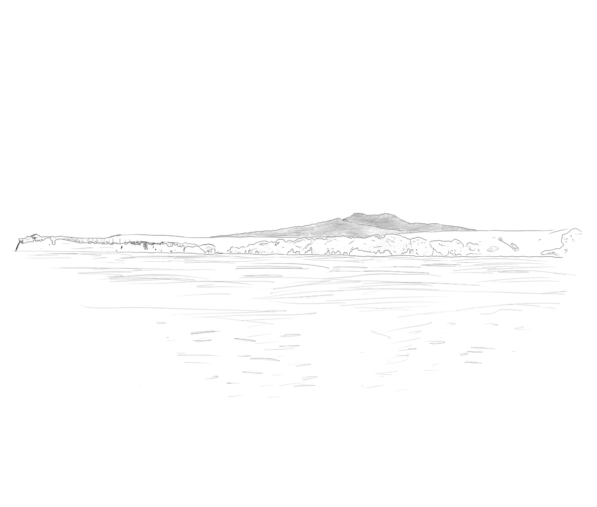
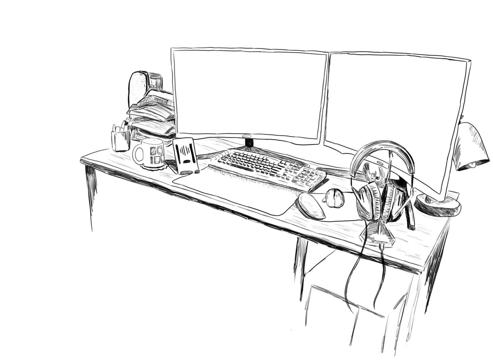
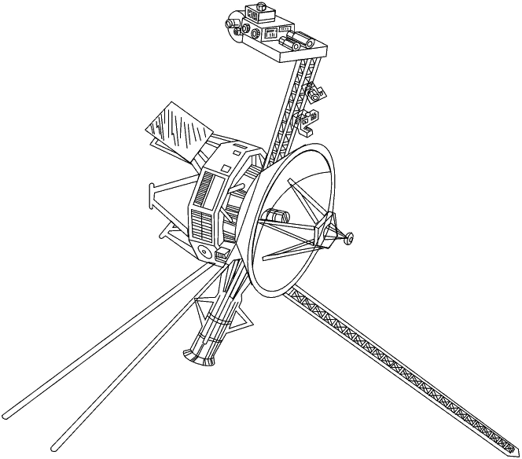
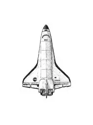
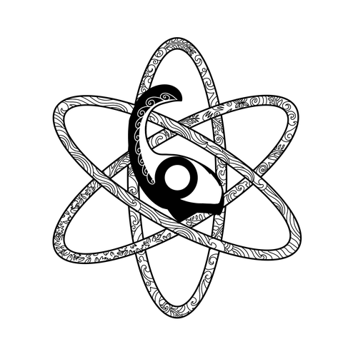

# G'day, Kia Ora

I'm Zane, a self-taught developer based in New Zealand. I work on compilers, chip design tools, and GPU software, mostly in C99 (with a minimalist flair). I also work on mainframes, everything from HLASM to Algol. Currently building a CUDA compiler that targets AMD and Tenstorrent hardware, and synthesising processors onto silicon with my own synthesis tool.

Everything is built from primary sources, original manuals, and the occasional declassified document.

The full list of projects, and the write ups explaining them, lives at [zanehambly.com](https://zanehambly.com). This page is the short version.

I like to be as transparent as possible in how I work. If you'd like to see my notes, assembly dumps and a mishmash of human and generated tests feel free to visit [bits and bobs](https://github.com/Zaneham/bits-and-bobs).

---

## Upstream Contributions

- **[OCaml](https://github.com/ocaml/ocaml)** - Occasional contributor to the native code compiler backend. Native atomics across all five architectures: [#14575](https://github.com/ocaml/ocaml/pull/14575), [#14980](https://github.com/ocaml/ocaml/pull/14980). s390x GOT-indirect calls: [#14547](https://github.com/ocaml/ocaml/pull/14547). Also [#14515](https://github.com/ocaml/ocaml/pull/14515)
- **[LLVM](https://github.com/llvm/llvm-project)** - X86 backend and MC layer: [#212417](https://github.com/llvm/llvm-project/pull/212417) applies the data32 mode switch in the Intel matcher, [#212803](https://github.com/llvm/llvm-project/pull/212803) stops personality info being emitted when the personality is not a function, [#213171](https://github.com/llvm/llvm-project/pull/213171) and [#213172](https://github.com/llvm/llvm-project/pull/213172) stop the encoder assuming a symbolic immediate is a literal
- **[LFortran](https://github.com/lfortran/lfortran)** - Legacy F77 `iargc` and `getarg` aliases: [#11679](https://github.com/lfortran/lfortran/pull/11679)
- **FFmpeg** - AVX2 for 10-bit H.264 pred16x16 intra prediction. 1.17x to 1.53x over SSE2 on Zen3, and 9.18x on the plane function, checkasm bit-exact. [Submitted to ffmpeg-devel](http://www.mail-archive.com/ffmpeg-devel@ffmpeg.org/msg186913.html), under review
- **[z390](https://github.com/z390development/z390)** - Core contributor to the IBM mainframe assembler/emulator, including COBOL macros, VSAM enhancements, and NIST test suite work
- **[qemu-zane](https://github.com/Zaneham/qemu-zane)** - QEMU fork adding QTSan for binary-only data race detection using shadow memory and vector clocks

---

## Key Projects

**[Takahe](https://github.com/Zaneham/Takahe)** - Open-source digital synthesis tool. SystemVerilog, VHDL and ABEL-HDL down to gate-level netlists, targeting four open PDKs (SKY130 130nm, IHP SG13G2, GF180MCU, ASAP7 7nm) and the 74LS series, where area is counted in packages rather than micrometres. Reads JEDEC fuse maps off old PLDs. Thirteen computing paradigms including ternary, quantum and probabilistic. Place and route through OpenROAD

**[Booth](https://github.com/Zaneham/Booth)** - Open-source GPU compiler. Takes CUDA, HIP and Triton and targets AMD (RDNA 2/3/4, CDNA3), NVIDIA PTX, Tenstorrent Tensix, or native x86-64/RV64 so GPU code runs on machines with no GPU. First CUDA compiled and running on Tenstorrent's non-SIMT RISC-V dataflow architecture. Fortran and OCaml frontends underway. Zero LLVM, own pipeline from preprocessor through to ELF emission. Binary is `kath`, after Kathleen Booth

**[Moa](https://github.com/Zaneham/Moa)** - Monte Carlo neutron transport in JPL-style C99. Neutrons are tracked one at a time through constructive solid geometry against ENDF/B-VII.1 cross sections, with resonance reconstruction and unresolved resonance probability tables. Validated on the Godiva, Jezebel and Flattop criticality benchmarks, and GPU-accelerated via Booth, so the kernel compiles with no NVCC anywhere near it and runs on an RTX 4060 Ti and an MI300X. Prebuilt binaries for Linux, Windows and macOS

**[Voyager FDS](https://github.com/Zaneham/voyager-fds-emulator)** - Emulator for the Voyager Flight Data Subsystem, the computer that's leaving the solar system. Built from JPL's own documentation, since the machine is 24 billion kilometres away and cannot be consulted. The same design has been synthesised to SKY130 silicon in 58 cells, so it runs as software and as a chip

**[Halmat](https://github.com/Zaneham/Halmat)** - A reconstructed specification of HALMAT, the intermediate language every line of Shuttle flight software passed through on its way to object code. Nobody documented it, so the reconstruction came from writing a PL/I F parser in OCaml and pointing it at 630 source files of a compiler last touched in the 1990s, written in a language from 1969, targeting hardware from 1964. The grammar is a hypothesis and Menhir is the interrogator, because every conflict the parser generator reports is the language telling you where its real edges are

---

## Skills

```
Languages     C99, OCaml, Fortran, HLASM, COBOL, TAL/TACL, Python
Compilers     OCaml native backend (Lambda -> CMM -> Mach -> asm), LLVM X86
              backend and MC layer, own pipelines from lexer through to ELF
GPU           AMD GFX9-12 ISA, NVIDIA PTX, Tenstorrent Tensix, HSA runtime
Silicon       SystemVerilog, VHDL, SKY130, IHP SG13G2, GF180MCU, ASAP7,
              OpenROAD, formal equivalence checking and fault injection
Mainframe     z/OS, HLASM, zCOBOL, Tandem NonStop (TACL, TAL)
Preservation  JOVIAL, CMS-2, CORAL 66, CHILL, MUMPS, PL/I, HAL/S, Plankalkul
```

---

Based in New Zealand, GMT+12/13

**zanehambly@gmail.com**

---

<p align="center">
  
  
  
  
</p>
<p align="center">
  
  
  
  
</p>
